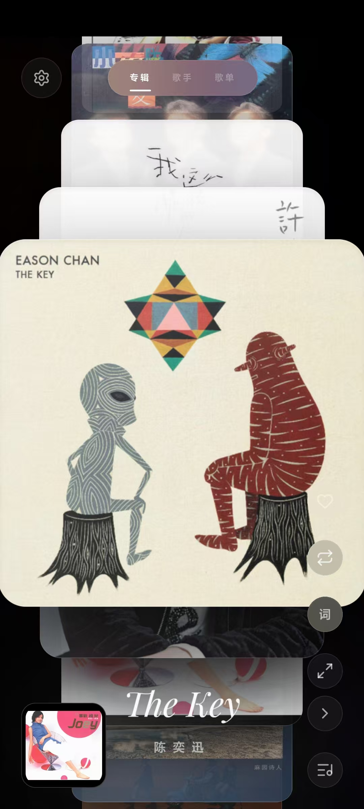
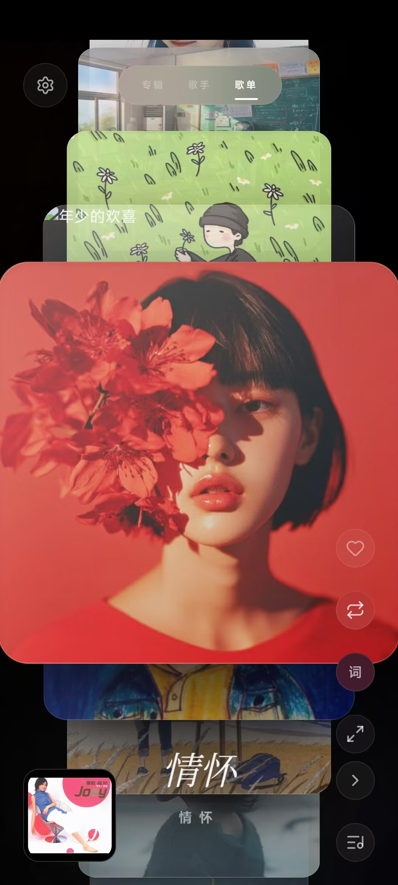
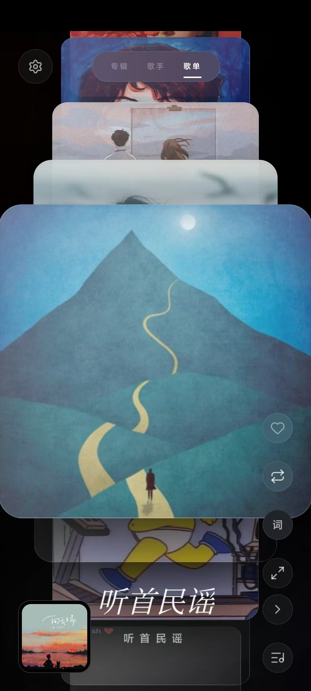
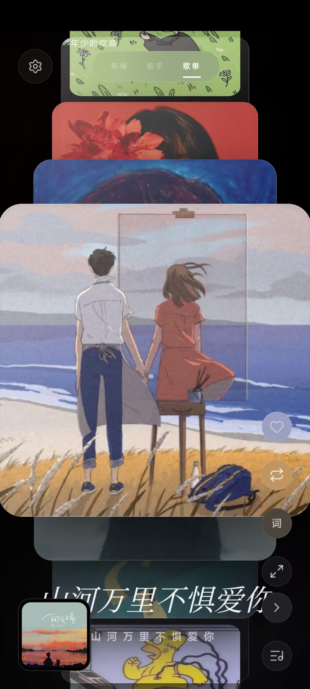
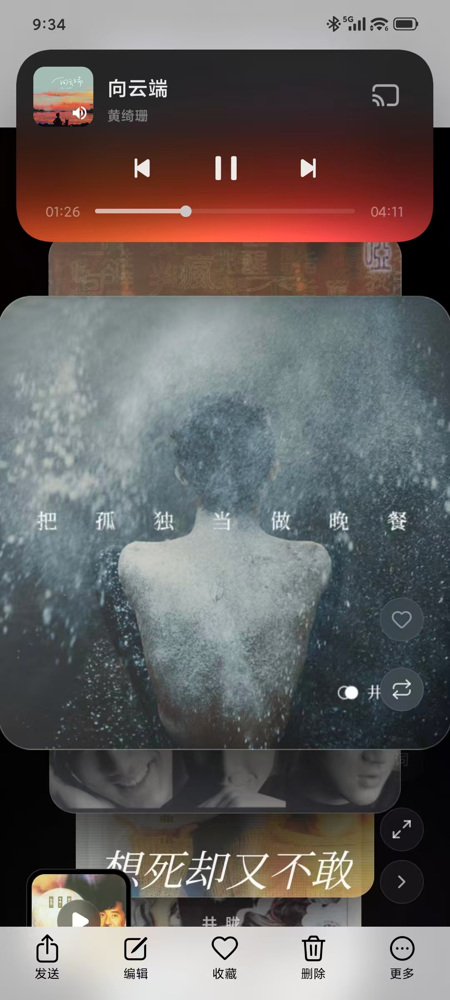
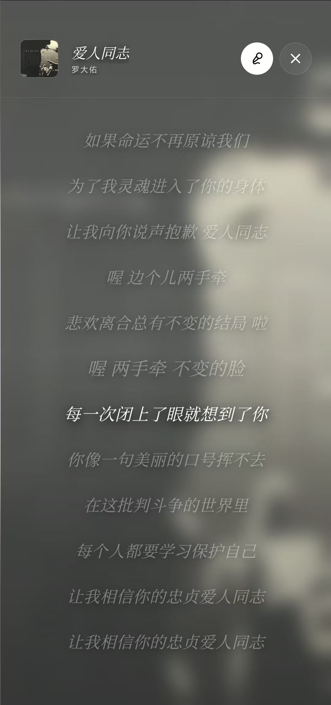

# MiguPod

一款优雅的音乐播放器，支持 Emby 和 Plex 媒体服务器，采用垂直封面流设计，提供沉浸式的音乐浏览和播放体验。

<div style="display:flex; flex-direction:row;">



</div>
~
<div style="display:flex; flex-direction:row;">



</div>


## 功能特性

### 媒体服务器支持
- **Emby** - 完整的 Emby 媒体库支持
- **Plex** - Plex Media Server 集成
- 自动连接验证和配置保存

### 音乐浏览
- **垂直封面流** - 独特的 3D 垂直滚动封面展示，支持触控手势
- **分类浏览** - 支持专辑、歌手、歌单三种视图
- **智能排序** - 支持按名称、时间、随机排序
- **流畅动画** - 使用 Framer Motion 实现丝滑的过渡效果

### 音乐播放
- **音频播放** - 支持主流音频格式流媒体播放
- **播放控制** - 播放/暂停、上一首/下一首、进度显示
- **播放模式** - 顺序播放、随机播放、单曲循环
- **背景播放** - 支持 Media Session API，可在后台控制

### 歌词显示
- **同步歌词** - 支持 LRC 格式同步歌词滚动
- **歌词切换** - 歌曲列表和歌词页面一键切换
- **快捷入口** - 右侧"词"按钮快速查看当前播放歌曲歌词

### 用户界面
- **响应式设计** - 适配桌面和移动设备
- **暗黑主题** - 优雅的深色界面设计
- **触控优化** - 完整的触摸手势支持
- **视觉反馈** - 点击音效和交互动画

### 其他功能
- **收藏功能** - 收藏喜欢的歌曲
- **全屏模式** - 一键进入全屏浏览
- **本地存储** - 配置和排序偏好自动保存

## 技术栈

- **React 19** - 用户界面框架
- **TypeScript** - 类型安全的 JavaScript
- **Vite** - 构建工具和开发服务器
- **Tailwind CSS** - 原子化 CSS 框架
- **Framer Motion** - 动画库
- **Lucide React** - 图标库

## 快速开始

### 环境要求
- Node.js 18+
- npm 或 yarn

### 安装依赖
```bash
npm install
```

### 开发模式
```bash
npm run dev
```
服务将启动在 http://localhost:3000

### 构建生产版本
```bash
npm run build
```

### 类型检查
```bash
npm run lint
```

## 使用指南

### 首次使用
1. 点击左上角设置按钮
2. 选择媒体服务器类型（Emby/Plex）
3. 输入服务器地址和 API 密钥
4. 保存配置后自动加载媒体库

### 浏览音乐
- **垂直滑动** - 浏览专辑/歌手封面
- **点击封面** - 查看歌曲列表
- **顶部导航** - 切换专辑/歌手/歌单视图
- **设置面板** - 调整排序方式

### 播放控制
- **左下角头像** - 点击播放/暂停
- **右侧按钮组** - 收藏、播放模式、歌词、全屏、下一首、播放列表
- **歌曲列表** - 点击歌曲开始播放

### 歌词查看
- 播放歌曲后，点击右侧"词"按钮
- 或在歌曲列表页点击麦克风图标切换

## 项目结构

```
src/
├── components/
│   └── VerticalCoverFlow.tsx  # 垂直封面流组件
├── services/
│   ├── emby.ts                # Emby API 服务
│   └── plex.ts                # Plex API 服务
├── lib/
│   └── utils.ts               # 工具函数
├── types.ts                   # TypeScript 类型定义
├── App.tsx                    # 主应用组件
├── main.tsx                   # 应用入口
└── index.css                  # 全局样式
```

## 配置说明

### Emby 配置
- **Server URL** - Emby 服务器地址，如 `https://emby.example.com`
- **API Key** - 在 Emby 后台生成的 API 密钥

### Plex 配置
- **Server URL** - Plex 服务器地址
- **Token** - Plex 访问令牌（X-Plex-Token）

## 浏览器支持

- Chrome 90+
- Firefox 88+
- Safari 14+
- Edge 90+

## 开源协议

Apache-2.0

## Docker 部署

### 使用 Docker Hub 镜像

```bash
# 拉取镜像
docker pull aidedaijiayang/migupod:latest

# 运行容器
docker run -d -p 3000:80 --name migupod aidedaijiayang/migupod:latest
```

### 本地构建

**Linux/macOS:**
```bash
# 本地构建（单架构）
./docker-build.sh

# 构建并推送到 Docker Hub
./docker-build.sh push
```

**Windows:**
```batch
REM 本地构建（单架构）
docker-build.bat

REM 构建并推送到 Docker Hub
docker-build.bat push
```

### 多架构支持

镜像支持以下架构：
- `linux/amd64` - x86_64 架构
- `linux/arm64` - ARM64 架构（如 Apple Silicon、树莓派）

### 环境变量

| 变量 | 说明 | 默认值 |
|------|------|--------|
| `PORT` | 服务端口 | `80` |

### Docker Compose 示例

```yaml
version: '3.8'

services:
  migupod:
    image: aidedaijiayang/migupod:latest
    container_name: migupod
    ports:
      - "3000:80"
    restart: unless-stopped
    healthcheck:
      test: ["CMD", "wget", "-q", "--spider", "http://localhost/health"]
      interval: 30s
      timeout: 10s
      retries: 3
```

## GitHub Actions 自动发布

项目配置了 GitHub Actions 工作流，支持以下触发方式：

- **Push 到 main/master 分支** - 自动构建并推送 `latest` 标签
- **Push 标签** - 自动构建并推送版本标签（如 `v1.0.0`）
- **Pull Request** - 仅构建，不推送

### 配置 Secrets

在 GitHub 仓库设置中添加以下 Secrets：

- `DOCKER_HUB_USERNAME` - Docker Hub 用户名
- `DOCKER_HUB_ACCESS_TOKEN` - Docker Hub 访问令牌（在 Account Settings → Security 中创建）

## 远程仓库

- GitHub: `git@github.com:migumigu/migupod.git`

## 赞助支持

如果您喜欢这个项目，可以通过以下方式赞助支持：

<div style="display:flex; flex-direction:row;">


</div>

您的支持将帮助我持续改进和维护这个项目，感谢您的关注与支持！